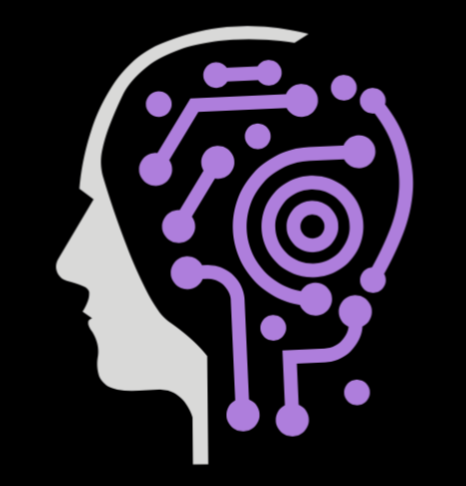

  
  <h2>Agentic AI @ Purdue</h2>
  
<em>Building the future of AI agents — together.</em>

  
  
  
  
  
  
  
  
  

   
  <a href="https://agentic-ai-purdue.github.io/join/">Join</a>
  ·
  <a href="https://agentic-ai-purdue.github.io/projects/">Projects</a>
  ·
  <a href="https://github.com/Agentic-AI-Purdue">GitHub</a>

---

### 🚀 Mission
Empower students to design, build, and deploy human‑centered AI agents by shipping fast, learning in public, and partnering with real users and organizations for measurable impact.

### 🧠 What we do
- **Learn & Build**: Hands‑on projects, weekly demos, and a 1‑week onboarding bootcamp.
- **Real Impact**: Solutions for real clients and campus needs.
- **Open Source**: Internal tools and frameworks shared by default.

### 🧭 Core values
- **Build to Learn** — we grow by shipping, not just studying.  
- **Clarity over Complexity** — simple, readable systems win.  
- **Open by Default** — share knowledge, code, and lessons.  
- **High Ownership** — if you see a problem, you own it.  
- **User‑Centered Design** — agents augment people; humans stay in control.  
- **Measure What Matters** — track outcomes, not vanity metrics.

### 🛠️ How we work
- **Pods**: Small teams of 5–7 own end‑to‑end delivery and demos.
- **Leadership**: Founders, CTO, project leads, sales lead, pod leaders.
- **Cadence**: Short cycles, weekly demos, lightweight post‑mortems.

### ⚙️ Tech we teach and use
- **Agent frameworks**: GoogleADK, Vercel SDK, LangChain, CrewAI  
- **Model SDKs**: openai‑sdk, langgraph 
- **Observability & evals**: Langfuse, Arize Phoenix  
- **Web & backend**: Next.js/React, FastAPI, Supabase  
We keep it practical—from prompt strategies and tool‑use to retrieval, workflows, evals, and post‑deployment monitoring.

### 💼 Projects
- Featured: AI Resume Reviewer — automated, actionable resume feedback for Purdue students  
  Tech: React, Python, OpenAI API, FastAPI  
  Source: `https://github.com/Agentic-AI-Purdue`  
Explore more: [/projects](/projects)

### 📊 Snapshot
- **5+** projects in motion
- **2** customers being onboarded
- **100%** open source
- Founded **2025**

### 🎯 2025 goals
- 50 active members by December
- Inter‑university collaborations
- Quarterly open‑source releases and public demos

### 🙌 Join us
Hungry, humble, and hands‑on? You’ll fit right in.  
- Apply: [/join](/join)  
- Questions: [/join#contact](/join#contact)  
- Code: `https://github.com/Agentic-AI-Purdue`
